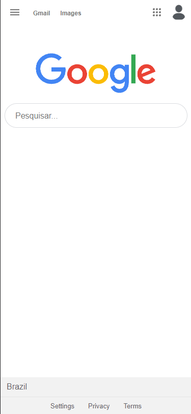
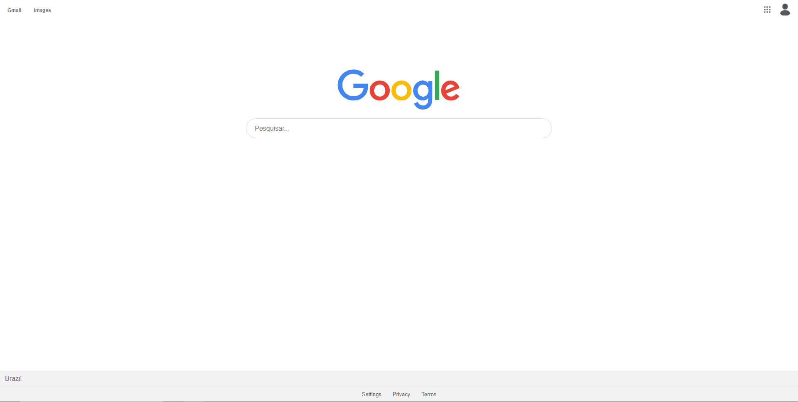

<h3 align="center">Aplicação Desenvolvida com a <a href="https://www.youtube.com/channel/UCSfwM5u0Kce6Cce8_S72olg">@Rocketseat</a> no UI Clone. Esse é um projeto totalmente responsivo, baseado na interface do<a href="https://www.google.com">@Google</a>.</h2>

---  

## 👨‍💻 Technologias Utilizadas

  <a href="https://en.wikipedia.org/wiki/HTML">HTML</a>&nbsp;&nbsp;&nbsp;|&nbsp;&nbsp;
  <a href="https://www.w3.org/Style/CSS/Overview.en.html">CSS</a>&nbsp;&nbsp;&nbsp;|&nbsp;&nbsp;
 <a href="https://www.javascript.com/">JavaScript</a>

### 📱 Mobile

  

---
  
### 💻 Desktop

  

---  

## 🔗 Link
https://google-homepage-orpin.vercel.app

<h4 align="center"> <em>&lt;/&gt;</em> by <a href="https://github.com/PhOmena" target="_blank">PhOmena</a> </h4>

